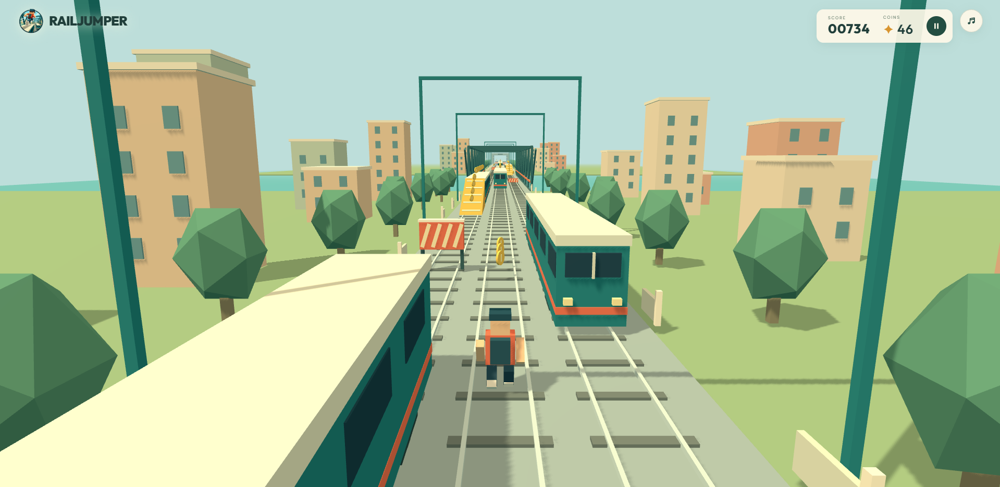

# RailJumper

**Play here: https://davidaugustat.github.io/rail-jumper-game/**

A colorful 3D endless railway runner built with TypeScript and Three.js. All gameplay, rendering, procedural models, sound effects, and score persistence run in the browser.

**Note:** This game was entirely vibe-coded using OpenAI Codex (GPT-6 Astra and GPT-5.6).



## Run locally

Requires Node.js 22.12+ (or a supported newer LTS release).

```sh
npm install
npm run dev
```

Open the local URL printed by Vite. Arrow left/right change tracks, up jumps (and cancels a slide), and down slides or cuts a jump short with a fast drop. On a phone or tablet, swipe in those same four directions anywhere on the game view. A fast drop starts a slide on landing, including on train roofs. Escape pauses or resumes. Enter starts/restarts. Low striped barriers can be jumped; elevated striped barriers can be slid under. Gold ramps let you run onto train roofs. Roof-launched jumps have a longer arc, allowing diagonal jumps across a short gap to an approaching train. Running off a roof drops you back to the tracks. Frontal impacts are fatal. The first lateral impact bounces the runner back and starts a ten-second warning window; another lateral impact during that window ends the run. Coins add 10 points each, and every meter adds one point.

## Build and verify

```sh
npm test
npm run build
npm run preview
```

Upload the contents of `dist/` to a static host. There is no application server, database, runtime API, or account system. Local development and preview use Vite to serve static frontend files. Best score and mute preference use localStorage when available. Browser audio starts only following player interaction.

A current desktop or mobile browser with WebGL 2 and hardware acceleration is required. The portrait layout supports screens down to 320 × 568 pixels. Models and sounds are generated locally. Difficulty rises from 18 to 30 meters/second. Train-heavy mixed rows pair one train with one barrier, and every third encounter adds a longer stationary ramp train beside a passing train. Each section preserves a reachable ground route; roof routes offer extra coins. Obstacles are generated 650 meters ahead, fog fades from 220 to 560 meters, and the 800-meter scenery loop includes enclosed tunnels and a truss bridge over water. A fixed 120 Hz simulation, instanced scenery, merged models, and recycled objects keep the longer view bounded.

## Structure

- `src/game.ts`: deterministic simulation, obstacle generation, collisions, scoring.
- `src/scene.ts`: procedural Three.js scene, animated runner, rendering and object reuse.
- `src/main.ts`, `src/style.css`: game screens, controls, pause/focus behavior, persistence.
- `src/audio.ts`: synthesized sound effects.
- `src/game.test.ts`: gameplay, action cancellation, ramp climbing, moving-roof landings, horizon generation, and extended-run tests.

## Browser smoke tests

With the local server running on port 5173:

```sh
npx playwright install --with-deps chromium
npm run test:browser
npm run test:rooftops
```

The Chromium tests exercise keyboard and swipe input, portrait layouts, pause, collisions, restart, focus loss, persisted settings, and resizing. Set `SCREENSHOTS=1` to capture screenshots under `/tmp/railjumper-chromium-*.png`. Fonts are bundled with the application; no external asset requests are required.

The rooftop browser test renders ramp climbs, jumps to passing trains, tunnels and the river bridge, and verifies the distant generation and model budget. `SCREENSHOTS=1 npm run test:rooftops` captures those scenes under `/tmp/railjumper-*.png`.
